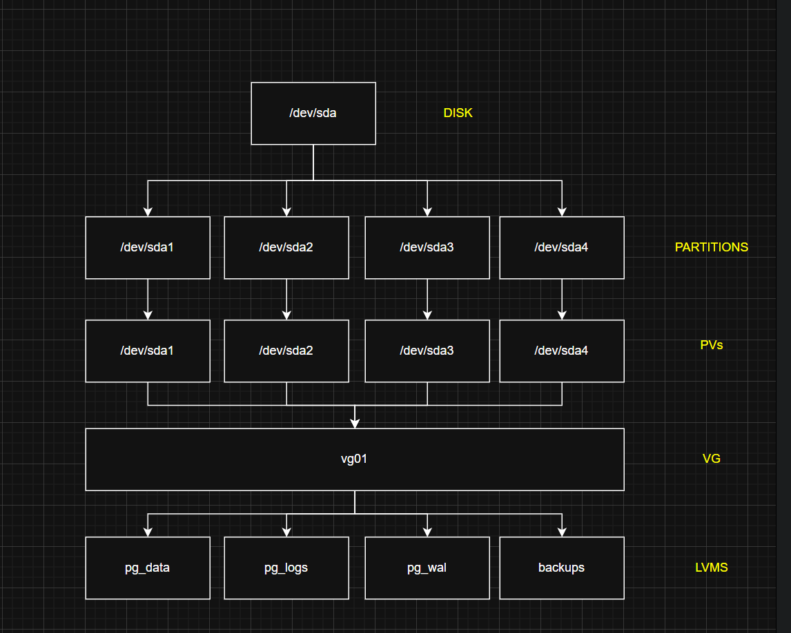

# Storage Management

# Introduction

Before we start installing and configuring the PostgreSQL instance and the pgBackRest, it is important 
to configure the storage, the place where the FileSystem for the PostgreSQL database resides.

In this documentation page, we will focus on creating the Logical Volumes (LVMs) for the 4 essential components of a 
PostgreSQL database: pg_data, pg_wal, pg_logs and backups. For each of them we will create Logical Volumes on the same 
disk.  

To create a LVM, we need to perform 4 steps: 
- Create a partition on the RAW disk
- Define Physical Volume (PV) on the partitioned disk.
- Prepare Volume Group (VG) using the created Physical Volume (PV).
- Creating a Logical Volume (LVM) from Volume Group’s (VG) available space.
- Create a FileSystem on the LVM

# 🧩Create a partition on the RAW disk

The first step we need to perform is to partition our disk. I order to partition our disk, we need to know:
- the available storage devices.
- choose one storage device
- inspect the specs of the chosen storage device (disk)

To list all the storage devices, use `lsblk`: 

```commandline
[student@localhost ~]$ lsblk
NAME          MAJ:MIN RM  SIZE RO TYPE MOUNTPOINTS
sda             8:0    0   20G  0 disk
├─sda1          8:1    0    1G  0 part /boot
└─sda2          8:2    0   19G  0 part
  ├─rhel-root 253:0    0   17G  0 lvm  /
  └─rhel-swap 253:1    0    2G  0 lvm  [SWAP]
sr0            11:0    1 1024M  0 rom

```

To check the specs of the storage device use `sudo fdisk -l /dev/<disk_name>`: 

```commandline
[student@localhost ~]$ sudo fdisk -l /dev/sda
[sudo] password for student:
Disk /dev/sda: 20 GiB, 21474836480 bytes, 41943040 sectors
Disk model: VBOX HARDDISK
Units: sectors of 1 * 512 = 512 bytes
Sector size (logical/physical): 512 bytes / 512 bytes
I/O size (minimum/optimal): 512 bytes / 512 bytes
Disklabel type: dos
Disk identifier: 0xcead329a

Device     Boot   Start      End  Sectors Size Id Type
/dev/sda1  *       2048  2099199  2097152   1G 83 Linux
/dev/sda2       2099200 41943039 39843840  19G 8e Linux LVM
```

As you can see, there is just one disk `/dev/sda` with 2 partitions: `/dev/sda1` and `/dev/sda2`. This is the 
default configuration when you create a RHEL 9 VM using the Oracle VirtualBox. 

I will now add a new disk on VM VirtualBox (/dev/sdb) which we will use to create partitions.

To add a new virtual hard disk, stop the VM, go to `Settings` > `Storage` > `Add hard disk` > `Create new disk` & 
`Format: VDI` & `Size: 20GB`. After you performed these steps, make sure you attached the new disk and start the VM. 

Use `lsblk` to check if the new disk was attached. 

~I will add also the KVM option in the future as it is important for our automation purposes.~

After we added the new `/dev/sdb` disk, we have to create partitions. To do that, use `sudo fdisk -uc /dev/sdb`: 

```commandline
[student@localhost ~]$ sudo fdisk -uc /dev/sdb

We trust you have received the usual lecture from the local System
Administrator. It usually boils down to these three things:

    #1) Respect the privacy of others.
    #2) Think before you type.
    #3) With great power comes great responsibility.

[sudo] password for student:

Welcome to fdisk (util-linux 2.37.4).
Changes will remain in memory only, until you decide to write them.
Be careful before using the write command.

Device does not contain a recognized partition table.
Created a new DOS disklabel with disk identifier 0xaacf4936.

Command (m for help): 
```
 
As you can see, after we executed `sudo fdisk -uc /dev/sdb`, this prompt appeared `Command (m for help):`. 
We used the following options: 
- `p` print the existing partition

```commandline
Command (m for help): p
Disk /dev/sdb: 20 GiB, 21474836480 bytes, 41943040 sectors
Disk model: VBOX HARDDISK
Units: sectors of 1 * 512 = 512 bytes
Sector size (logical/physical): 512 bytes / 512 bytes
I/O size (minimum/optimal): 512 bytes / 512 bytes
Disklabel type: dos
Disk identifier: 0xaacf4936
```

- `n` create a **new partition**
- `p` create with a new **primary partition**
- `1` assign the number to mark the partition as the first primary partition (or press `Enter` to use the recommended 
default option).
- 'Enter' to choose `2048` as the first sector.
- `+1G` to set the partition size at 1G starting from sector 2048 OR `Enter` once again to utilize the full disk space for a single primary partition

```commandline
Command (m for help): n
Partition type
   p   primary (0 primary, 0 extended, 4 free)
   e   extended (container for logical partitions)
Select (default p): p
Partition number (1-4, default 1):
First sector (2048-41943039, default 2048):
Last sector, +/-sectors or +/-size{K,M,G,T,P} (2048-41943039, default 41943039): +1G

Created a new partition 1 of type 'Linux' and of size 1 GiB.
```

- `p` to print and verify the created disk

```commandline
Command (m for help): p
Disk /dev/sdb: 20 GiB, 21474836480 bytes, 41943040 sectors
Disk model: VBOX HARDDISK
Units: sectors of 1 * 512 = 512 bytes
Sector size (logical/physical): 512 bytes / 512 bytes
I/O size (minimum/optimal): 512 bytes / 512 bytes
Disklabel type: dos
Disk identifier: 0xaacf4936

Device     Boot Start     End Sectors Size Id Type
/dev/sdb1        2048 2099199 2097152   1G 83 Linux
```

- `t` Change the type of partition to LVM using “8e”.

```commandline
Command (m for help): t
Selected partition 1
Hex code or alias (type L to list all): L

00 Empty            24 NEC DOS          81 Minix / old Lin  bf Solaris
01 FAT12            27 Hidden NTFS Win  82 Linux swap / So  c1 DRDOS/sec (FAT-
02 XENIX root       39 Plan 9           83 Linux            c4 DRDOS/sec (FAT-
03 XENIX usr        3c PartitionMagic   84 OS/2 hidden or   c6 DRDOS/sec (FAT-
04 FAT16 <32M       40 Venix 80286      85 Linux extended   c7 Syrinx
05 Extended         41 PPC PReP Boot    86 NTFS volume set  da Non-FS data
06 FAT16            42 SFS              87 NTFS volume set  db CP/M / CTOS / .
07 HPFS/NTFS/exFAT  4d QNX4.x           88 Linux plaintext  de Dell Utility
08 AIX              4e QNX4.x 2nd part  8e Linux LVM        df BootIt
09 AIX bootable     4f QNX4.x 3rd part  93 Amoeba           e1 DOS access
0a OS/2 Boot Manag  50 OnTrack DM       94 Amoeba BBT       e3 DOS R/O
0b W95 FAT32        51 OnTrack DM6 Aux  9f BSD/OS           e4 SpeedStor
0c W95 FAT32 (LBA)  52 CP/M             a0 IBM Thinkpad hi  ea Linux extended
0e W95 FAT16 (LBA)  53 OnTrack DM6 Aux  a5 FreeBSD          eb BeOS fs
0f W95 Ext'd (LBA)  54 OnTrackDM6       a6 OpenBSD          ee GPT
10 OPUS             55 EZ-Drive         a7 NeXTSTEP         ef EFI (FAT-12/16/
11 Hidden FAT12     56 Golden Bow       a8 Darwin UFS       f0 Linux/PA-RISC b
12 Compaq diagnost  5c Priam Edisk      a9 NetBSD           f1 SpeedStor
14 Hidden FAT16 <3  61 SpeedStor        ab Darwin boot      f4 SpeedStor
16 Hidden FAT16     63 GNU HURD or Sys  af HFS / HFS+       f2 DOS secondary
17 Hidden HPFS/NTF  64 Novell Netware   b7 BSDI fs          fb VMware VMFS
18 AST SmartSleep   65 Novell Netware   b8 BSDI swap        fc VMware VMKCORE
1b Hidden W95 FAT3  70 DiskSecure Mult  bb Boot Wizard hid  fd Linux raid auto
1c Hidden W95 FAT3  75 PC/IX            bc Acronis FAT32 L  fe LANstep
1e Hidden W95 FAT1  80 Old Minix        be Solaris boot     ff BBT

Aliases:
   linux          - 83
   swap           - 82
   extended       - 05
   uefi           - EF
   raid           - FD
   lvm            - 8E
   linuxex        - 85
Hex code or alias (type L to list all): 8e
Changed type of partition 'Linux' to 'Linux LVM'.

```

- `p` Again print and verify before writing changes.

```commandline
Command (m for help): p
Disk /dev/sdb: 20 GiB, 21474836480 bytes, 41943040 sectors
Disk model: VBOX HARDDISK
Units: sectors of 1 * 512 = 512 bytes
Sector size (logical/physical): 512 bytes / 512 bytes
I/O size (minimum/optimal): 512 bytes / 512 bytes
Disklabel type: dos
Disk identifier: 0xaacf4936

Device     Boot Start     End Sectors Size Id Type
/dev/sdb1        2048 2099199 2097152   1G 8e Linux LVM

```

- `w` write and exit from the `fdisk` utility.

```commandline
Command (m for help): w
The partition table has been altered.
Calling ioctl() to re-read partition table.
Syncing disks.
```

Use `lsblk` to check the new partition (/dev/sdb1):

```commandline
[student@localhost ~]$ lsblk
NAME          MAJ:MIN RM  SIZE RO TYPE MOUNTPOINTS
sda             8:0    0   20G  0 disk
├─sda1          8:1    0    1G  0 part /boot
└─sda2          8:2    0   19G  0 part
  ├─rhel-root 253:0    0   17G  0 lvm  /
  └─rhel-swap 253:1    0    2G  0 lvm  [SWAP]
sdb             8:16   0   20G  0 disk
└─sdb1          8:17   0    1G  0 part
sr0            11:0    1 1024M  0 rom
```

You can see that it has 1G.

What we did here was to update the partition table on disk. We now have to make the kernel to reload the 
partition table once again so that the changes to be in place. To do that, use:

```commandline
sudo partprobe /dev/sdb
```

# 💽Creating a Physical Volume (PV)

Now that we created ourselves a 1G partition inside the /dev/sdb disk, it is time to create a Physical 
Volume out of it. 

To create a Physical Volume (PV) use the `sudo pvcreate /dev/sdb1` command: 

```commandline
[student@localhost ~]$ sudo pvcreate /dev/sdb1
[sudo] password for student:
  Physical volume "/dev/sdb1" successfully created.
[student@localhost ~]$ sudo pvs
  PV         VG   Fmt  Attr PSize   PFree
  /dev/sda2  rhel lvm2 a--  <19.00g    0
  /dev/sdb1       lvm2 ---    1.00g 1.00g
[student@localhost ~]$ sudo pvdisplay /dev/sdb1
  "/dev/sdb1" is a new physical volume of "1.00 GiB"
  --- NEW Physical volume ---
  PV Name               /dev/sdb1
  VG Name
  PV Size               1.00 GiB
  Allocatable           NO
  PE Size               0
  Total PE              0
  Free PE               0
  Allocated PE          0
  PV UUID               XRG2VV-tV28-1I1C-kPtN-Y8g9-lBGx-LHA0cL
```

To list all the PVs, use `pvs` command. If you want to get into details of the recently created PV,
use `sudo pvdisplay /dev/sdb1`
 
# 🧱Creating a Volume Group (VG)

Now that we created ourselves a `PV` on the `/dev/sdb1`, it is time to create a Volume Group (VG).  

To create a new Volume Group, using the previously created PV (/dev/sdb1), we use:

```commandline
[student@localhost ~]$ sudo vgcreate vg01 /dev/sdb1
[sudo] password for student:
  Volume group "vg01" successfully created
```

We created a VG named `vg01`, using the /dev/sdb1 PV.

To check the newly created VG, use the `vgs` or the `vgdisplay` like this: 

```commandline
[student@localhost ~]$ sudo vgs
  VG   #PV #LV #SN Attr   VSize    VFree
  rhel   1   2   0 wz--n-  <19.00g       0
  vg01   1   0   0 wz--n- 1020.00m 1020.00m
[student@localhost ~]$ sudo vgdisplay vg01
  --- Volume group ---
  VG Name               vg01
  System ID
  Format                lvm2
  Metadata Areas        1
  Metadata Sequence No  1
  VG Access             read/write
  VG Status             resizable
  MAX LV                0
  Cur LV                0
  Open LV               0
  Max PV                0
  Cur PV                1
  Act PV                1
  VG Size               1020.00 MiB
  PE Size               4.00 MiB
  Total PE              255
  Alloc PE / Size       0 / 0
  Free  PE / Size       255 / 1020.00 MiB
  VG UUID               POoWPL-FvEX-iC3g-26NR-7LGZ-Rhoc-6HcnAE
```

It is important to mention that PE (Physical Extent) represents the unit in which the VG is divided into. By default, a PE has 4MiB. It we 
divide 1020 MiB (which is the VG size) by 4MiB, we get 255 PEs. So, we have a VG which can be divided into 255 pieces 
of 4 MiB each. 

We can also create a VG using multiple PVs: 

```commandline
vgcreate vg02 /dev/sdb2 /dev/sdb3 /dev/sdb4 ...
```

# 📁Creating a Logical Volume (LVM)

After we created the Volume Group (VG), we are basically able to create Logical Volumes (LVMs) by taking space from 
the VG. There are 2 ways we can create a LVM:
- using Unit Size (-L)
- using Physical Extent (-l)

## Create LVM Using Unit Size

Create logical volume named “data” using 1000M under “vg01”.

```commandline
[student@localhost ~]$ sudo lvcreate -n data -L 1000M vg01
[sudo] password for student:
  Logical volume "data" created.
[student@localhost ~]$ sudo lvs
  LV   VG   Attr       LSize    Pool Origin Data%  Meta%  Move Log Cpy%Sync Convert
  root rhel -wi-ao----  <17.00g
  swap rhel -wi-ao----    2.00g
  data vg01 -wi-a----- 1000.00m
[student@localhost ~]$ sudo lvdisplay /dev/mapper/vg01-data
  --- Logical volume ---
  LV Path                /dev/vg01/data
  LV Name                data
  VG Name                vg01
  LV UUID                N4Exfj-mj3r-QPvy-TS8n-nNvQ-1Hi2-fKPlgi
  LV Write Access        read/write
  LV Creation host, time localhost.localdomain, 2026-04-11 23:08:40 +0300
  LV Status              available
  # open                 0
  LV Size                1000.00 MiB
  Current LE             250
  Segments               1
  Allocation             inherit
  Read ahead sectors     auto
  - currently set to     256
  Block device           253:2
```

We used the `lvs` and `lvdisplay` commands to check our newly created LVM.

## Create LVM using Physical Extent

```commandline
sudo lvcreate -l 160 -n backup vg01 
sudo lvs 
sudo lvdisplay /dev/mapper/vg01-backup
```

# 🧾 Create a FileSystem on the LVM

Now that we successfully created a LVM, we have to create a FileSystem on it. 

To do that:

```commandline
[student@localhost ~]$ sudo mkfs.xfs /dev/vg01/data
[sudo] password for student:
meta-data=/dev/vg01/data         isize=512    agcount=4, agsize=130560 blks
         =                       sectsz=512   attr=2, projid32bit=1
         =                       crc=1        finobt=1, sparse=1, rmapbt=0
         =                       reflink=1    bigtime=1 inobtcount=1 nrext64=0
data     =                       bsize=4096   blocks=522240, imaxpct=25
         =                       sunit=0      swidth=0 blks
naming   =version 2              bsize=4096   ascii-ci=0, ftype=1
log      =internal log           bsize=4096   blocks=16384, version=2
         =                       sectsz=512   sunit=0 blks, lazy-count=1
realtime =none                   extsz=4096   blocks=0, rtextents=0

```

# Mount the LVM 

```commandline
[student@localhost ~]$ sudo df -hT
[sudo] password for student:
Filesystem            Type      Size  Used Avail Use% Mounted on
devtmpfs              devtmpfs  4.0M     0  4.0M   0% /dev
tmpfs                 tmpfs     1.8G     0  1.8G   0% /dev/shm
tmpfs                 tmpfs     732M  9.2M  722M   2% /run
/dev/mapper/rhel-root xfs        17G  5.3G   12G  31% /
/dev/sda1             xfs       960M  373M  588M  39% /boot
tmpfs                 tmpfs     366M  104K  366M   1% /run/user/1000
[student@localhost ~]$ cd /mnt
[student@localhost mnt]$ ls
[student@localhost mnt]$ ls
[student@localhost mnt]$ sudo mkdir /mnt/data
[student@localhost mnt]$ ls
data
[student@localhost mnt]$ ls -ltr
total 0
drwxr-xr-x. 2 root root 6 Apr 11 23:47 data
[student@localhost mnt]$ sudo mount /dev/vg01/data /mnt/data
[student@localhost mnt]$ sudo df -hT
Filesystem            Type      Size  Used Avail Use% Mounted on
devtmpfs              devtmpfs  4.0M     0  4.0M   0% /dev
tmpfs                 tmpfs     1.8G     0  1.8G   0% /dev/shm
tmpfs                 tmpfs     732M  9.2M  722M   2% /run
/dev/mapper/rhel-root xfs        17G  5.3G   12G  31% /
/dev/sda1             xfs       960M  373M  588M  39% /boot
tmpfs                 tmpfs     366M  104K  366M   1% /run/user/1000
/dev/mapper/vg01-data xfs       2.0G   47M  1.9G   3% /mnt/data

```

# The architecture we will implement

- 1 disk of 20GB
- 4 partitions of 4G each
- 4 PVs
- 1 VG out of the 4 PVs
- 4 LVMs obtained from the 1 VGs
  - pg_data LVM - xfs - mounted on /mnt/pg_data
  - pg_logs LVM - xfs - mounted on /mnt/pg_logs
  - pg_wal LVM - xfs - mounted on /mnt/pg_wal
  - backups LVM -xfs - mounted on /mnt/backups

This is the visual representation described above: 



# Procedures

## Extend LVM 

If you want to extend the LVM, you will have to extend the VG. If you want to extend the VG, you will have to add new
PVs. To add new PVs, you need to create new partitions. 


Check the current status:

```commandline
[student@localhost ~]$ lsblk
NAME          MAJ:MIN RM  SIZE RO TYPE MOUNTPOINTS
sda             8:0    0   20G  0 disk
├─sda1          8:1    0    1G  0 part /boot
└─sda2          8:2    0   19G  0 part
  ├─rhel-root 253:0    0   17G  0 lvm  /
  └─rhel-swap 253:1    0    2G  0 lvm  [SWAP]
sdb             8:16   0   20G  0 disk
└─sdb1          8:17   0    1G  0 part
  └─vg01-data 253:2    0 1000M  0 lvm
sr0            11:0    1 1024M  0 rom
```

As you can see, we have 19G free space on the /dev/sdb disk.

We can create a new partition:

```commandline
[student@localhost ~]$ sudo fdisk /dev/sdb

Welcome to fdisk (util-linux 2.37.4).
Changes will remain in memory only, until you decide to write them.
Be careful before using the write command.

This disk is currently in use - repartitioning is probably a bad idea.
It's recommended to umount all file systems, and swapoff all swap
partitions on this disk.


Command (m for help): p

Disk /dev/sdb: 20 GiB, 21474836480 bytes, 41943040 sectors
Disk model: VBOX HARDDISK
Units: sectors of 1 * 512 = 512 bytes
Sector size (logical/physical): 512 bytes / 512 bytes
I/O size (minimum/optimal): 512 bytes / 512 bytes
Disklabel type: dos
Disk identifier: 0xaacf4936

Device     Boot Start     End Sectors Size Id Type
/dev/sdb1        2048 2099199 2097152   1G 8e Linux LVM

Command (m for help): n
Partition type
   p   primary (1 primary, 0 extended, 3 free)
   e   extended (container for logical partitions)
Select (default p): p
Partition number (2-4, default 2):
First sector (2099200-41943039, default 2099200):
Last sector, +/-sectors or +/-size{K,M,G,T,P} (2099200-41943039, default 41943039): +1G

Created a new partition 2 of type 'Linux' and of size 1 GiB.

Command (m for help): p
Disk /dev/sdb: 20 GiB, 21474836480 bytes, 41943040 sectors
Disk model: VBOX HARDDISK
Units: sectors of 1 * 512 = 512 bytes
Sector size (logical/physical): 512 bytes / 512 bytes
I/O size (minimum/optimal): 512 bytes / 512 bytes
Disklabel type: dos
Disk identifier: 0xaacf4936

Device     Boot   Start     End Sectors Size Id Type
/dev/sdb1          2048 2099199 2097152   1G 8e Linux LVM
/dev/sdb2       2099200 4196351 2097152   1G 83 Linux

Command (m for help): t
Partition number (1,2, default 2):
Hex code or alias (type L to list all): 8e

Changed type of partition 'Linux' to 'Linux LVM'.

Command (m for help): p
Disk /dev/sdb: 20 GiB, 21474836480 bytes, 41943040 sectors
Disk model: VBOX HARDDISK
Units: sectors of 1 * 512 = 512 bytes
Sector size (logical/physical): 512 bytes / 512 bytes
I/O size (minimum/optimal): 512 bytes / 512 bytes
Disklabel type: dos
Disk identifier: 0xaacf4936

Device     Boot   Start     End Sectors Size Id Type
/dev/sdb1          2048 2099199 2097152   1G 8e Linux LVM
/dev/sdb2       2099200 4196351 2097152   1G 8e Linux LVM

Command (m for help): w
The partition table has been altered.
Syncing disks.

[student@localhost ~]$ sudo partprobe /dev/sdb
[student@localhost ~]$ lsblk
NAME          MAJ:MIN RM  SIZE RO TYPE MOUNTPOINTS
sda             8:0    0   20G  0 disk
├─sda1          8:1    0    1G  0 part /boot
└─sda2          8:2    0   19G  0 part
  ├─rhel-root 253:0    0   17G  0 lvm  /
  └─rhel-swap 253:1    0    2G  0 lvm  [SWAP]
sdb             8:16   0   20G  0 disk
├─sdb1          8:17   0    1G  0 part
│ └─vg01-data 253:2    0 1000M  0 lvm
└─sdb2          8:18   0    1G  0 part
sr0            11:0    1 1024M  0 rom
```

After we created a new partition, we can create a new PV:

```commandline
[student@localhost ~]$ sudo pvcreate /dev/sdb2
  Physical volume "/dev/sdb2" successfully created.
```

Extend the VG named `vg01` with the `/dev/sdb2` PV:

```commandline
[student@localhost ~]$ sudo vgextend vg01 /dev/sdb2
  Volume group "vg01" successfully extended
[student@localhost ~]$ lsblk
NAME          MAJ:MIN RM  SIZE RO TYPE MOUNTPOINTS
sda             8:0    0   20G  0 disk
├─sda1          8:1    0    1G  0 part /boot
└─sda2          8:2    0   19G  0 part
  ├─rhel-root 253:0    0   17G  0 lvm  /
  └─rhel-swap 253:1    0    2G  0 lvm  [SWAP]
sdb             8:16   0   20G  0 disk
├─sdb1          8:17   0    1G  0 part
│ └─vg01-data 253:2    0 1000M  0 lvm
└─sdb2          8:18   0    1G  0 part
sr0            11:0    1 1024M  0 rom

```

Check the VG:

```commandline
[student@localhost ~]$ sudo vgs
  VG   #PV #LV #SN Attr   VSize   VFree
  rhel   1   2   0 wz--n- <19.00g     0
  vg01   2   1   0 wz--n-   1.99g <1.02g
[student@localhost ~]$ sudo vgdisplay vg01
  --- Volume group ---
  VG Name               vg01
  System ID
  Format                lvm2
  Metadata Areas        2
  Metadata Sequence No  3
  VG Access             read/write
  VG Status             resizable
  MAX LV                0
  Cur LV                1
  Open LV               0
  Max PV                0
  Cur PV                2
  Act PV                2
  VG Size               1.99 GiB
  PE Size               4.00 MiB
  Total PE              510
  Alloc PE / Size       250 / 1000.00 MiB
  Free  PE / Size       260 / <1.02 GiB
  VG UUID               POoWPL-FvEX-iC3g-26NR-7LGZ-Rhoc-6HcnAE
```

Extend the LVM:

- extend the LVM named `/dev/vg01/data` using all the free space from the vg01 VG

```commandline
[student@localhost ~]$ sudo lvextend -l +100%FREE /dev/vg01/data
  Size of logical volume vg01/data changed from 1000.00 MiB (250 extents) to 1.99 GiB (510 extents).
  Logical volume vg01/data successfully resized.
```

- extend the LVM named `/dev/vg01/data` with 10G from the VG

```commandline
lvextend -L +10G /dev/vg01/data
```

Check the status:

```commandline
[student@localhost ~]$ sudo lvdisplay /dev/vg01/data
  --- Logical volume ---
  LV Path                /dev/vg01/data
  LV Name                data
  VG Name                vg01
  LV UUID                N4Exfj-mj3r-QPvy-TS8n-nNvQ-1Hi2-fKPlgi
  LV Write Access        read/write
  LV Creation host, time localhost.localdomain, 2026-04-11 23:08:40 +0300
  LV Status              available
  # open                 0
  LV Size                1.99 GiB
  Current LE             510
  Segments               2
  Allocation             inherit
  Read ahead sectors     auto
  - currently set to     256
  Block device           253:2

[student@localhost ~]$ sudo lsblk
NAME          MAJ:MIN RM  SIZE RO TYPE MOUNTPOINTS
sda             8:0    0   20G  0 disk
├─sda1          8:1    0    1G  0 part /boot
└─sda2          8:2    0   19G  0 part
  ├─rhel-root 253:0    0   17G  0 lvm  /
  └─rhel-swap 253:1    0    2G  0 lvm  [SWAP]
sdb             8:16   0   20G  0 disk
├─sdb1          8:17   0    1G  0 part
│ └─vg01-data 253:2    0    2G  0 lvm
└─sdb2          8:18   0    1G  0 part
  └─vg01-data 253:2    0    2G  0 lvm
sr0            11:0    1 1024M  0 rom
```

We extended the LVM by adding PE/Units from the VG, but we need also to extend the FS with the LVM.

TO do that, use: 

```commandline
xfs_growfs /data
```

OR

You extend the FS at the same time with the LVM

```commandline
lvextend -r -l +100%FREE /dev/vg01/data
```

# Ansible Automated Procedures for PostgreSQL 


# Refrences

This material was created using the following resource: 
https://medium.com/@kalyanbtech08/creating-logical-volume-management-lvm-file-system-in-linux-51dad2cb3b29
https://docs.ansible.com/projects/ansible/latest/collections/community/general/parted_module.html#parameter-part_type
https://docs.ansible.com/projects/ansible/latest/collections/ansible/builtin/include_role_module.html
https://kodekloud.com/blog/linux-list-disks/

